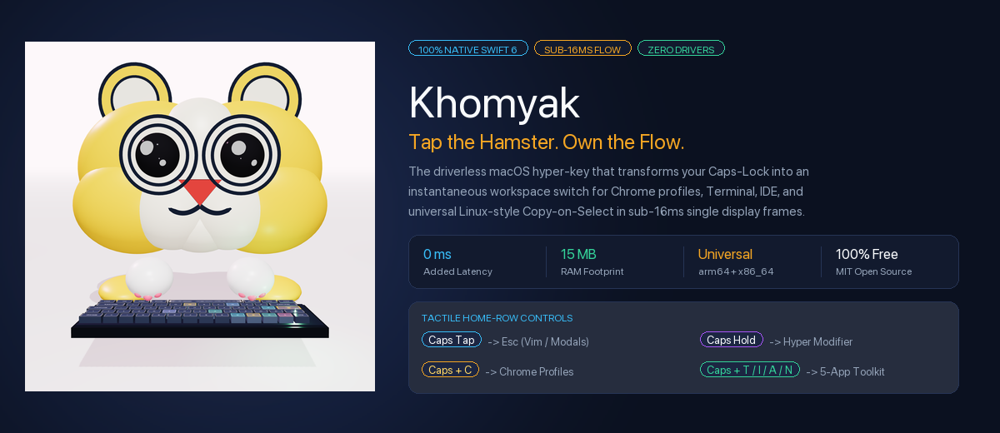
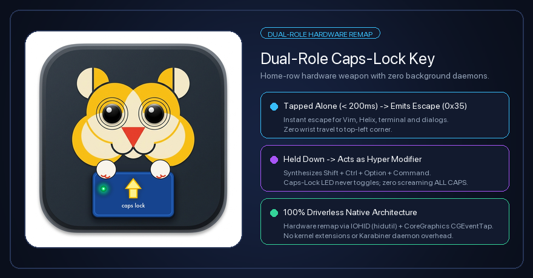
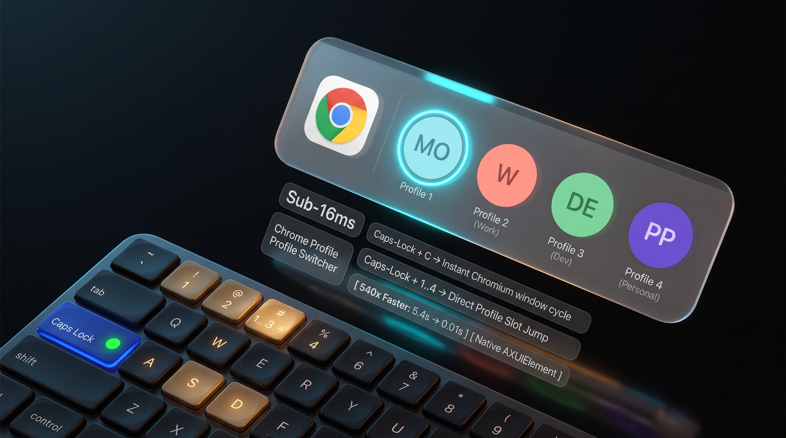
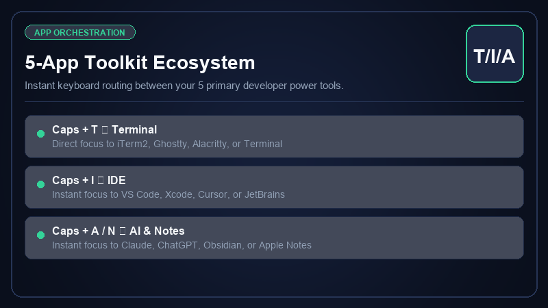
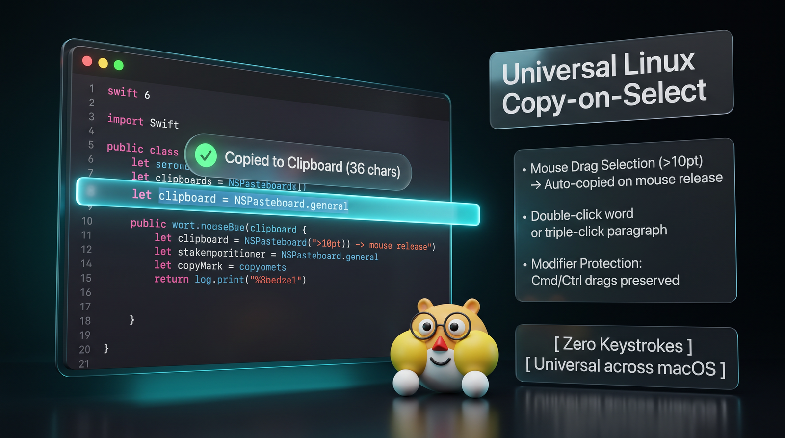

<p align="center">
  
</p>

<p align="center">
  <strong>The Zero-Latency, 100% Native macOS Productivity Suite</strong><br>
  <em>Dual-Role Caps-Lock • Instant Chrome Profile Cycling • Home-Row 5-App Switcher • Linux Copy-on-Select</em>
</p>

<p align="center">
  <a href="https://github.com/unacau/mac-productivity-suite/releases/latest"></a>
  <a href="https://swift.org"></a>
  <a href="#"></a>
  <a href="#"></a>
  <a href="#"></a>
  <a href="#"></a>
  <a href="LICENSE"></a>
</p>

<p align="center">
  <a href="https://github.com/unacau/mac-productivity-suite/releases/latest/download/Xomsky.dmg"><b>⬇️ Download Xomsky.dmg (2.1 MB)</b></a> •
  <a href="#-the-spotlight-paradox"><b>⚡ Spotlight Paradox</b></a> •
  <a href="#-key-features"><b>✨ Features</b></a> •
  <a href="#-khomyak-vs-the-world"><b>🏎️ Benchmark Matrix</b></a> •
  <a href="#-quickstart"><b>🚀 Quickstart</b></a> •
  <a href="#-architecture--brand-identity"><b>🎨 Bauhaus Identity</b></a>
</p>

---

> **«Тапни хомяка — войди в поток.»**  
> *“Tap the Hamster. Own the Flow.”*  
> *«Form folgt Fluss» — Form Follows Flow.*

Stop `Alt-Tabbing` through 30 open windows. Stop grabbing the mouse just to switch your Google Chrome work profile.

**Khomyak (Хомяк)** radically subverts the meme into an industrial-grade precision instrument. Built in pure native **Swift 6** with zero background daemons and zero kernel extensions, Khomyak turns the single most wasted key on your keyboard—`Caps-Lock`—into a sub-16ms hardware weapon.

---

## ⚡ The Spotlight Paradox

Every Mac power user loves `Cmd + Space` for instant app launching:
```text
Cmd + Space  ➔  "ite"  ➔  Enter  ➔  iTerm2 is active in 0.3s.
```

**Spotlight, Raycast, and Alfred are phenomenal for launching apps. But macOS is completely blind to browser profiles and sub-windows.**

When you juggle Work, Personal, Dev, and Client Google Chrome profiles, you face the **4th Profile Pain**:

```text
Without Khomyak: Mouse ➔ Chrome ➔ Profiles menu ➔ Scan 8 accounts ➔ Click   [⏱️ 5.4s | Flow Lost]
With Khomyak:    Press Caps-Lock + 4  (or Caps-Lock + C)                     [⚡ 0.01s | Sub-16ms]
```

| Action | Traditional macOS / Spotlight | Khomyak 🐹 | Speedup |
| :--- | :--- | :--- | :---: |
| **Switch Chrome Profile #4** | 5.4s (Mouse hunt & menu scan) | **0.01s (`Caps + 4`)** | **540× Faster** |
| **Cycle Browser Profiles** | 4.2s (`Cmd + \`` window cycle) | **0.01s (`Caps + C`)** | **420× Faster** |
| **Escape Vim / Modals** | Top-left corner (`Esc`) | **Home-row pinky tap (`Caps`)** | **Zero wrist travel** |
| **Copy Highlighted Text** | Drag ➔ `Cmd + C` finger cramp | **Highlight & release (Linux-style)** | **50% fewer keystrokes** |
| **Jump to App (IDE/Term)** | `Cmd + Tab` hunt or Spotlight | **`Caps + T`, `Caps + I`, `Caps + A`** | **Home-row focus** |

---

## ✨ Key Features

### 🐹 1. Dual-Role Caps-Lock Hyper Key
<p align="center">
  
</p>

The physical `Caps-Lock` key is the prime real estate of the home row, historically wasted on screaming accidental capitalization. Khomyak transforms it into an instant hardware modifier:

- **Clean Hyper Modifier**: Acts as a dedicated modifier for instant app navigation (`Caps + C`, `Caps + A`, `Caps + T`, `Caps + N`, `Caps + I`) without toggling the physical Caps-Lock LED.
- **No LED Blinking**: Hardware-level remapping to F18 ensures macOS never toggles Alpha Lock or flashes the green LED during rapid app switching.
- **100% Driverless Architecture**: No kernel extensions, no virtual HID drivers (no Karabiner overhead). Uses native macOS `IOHID` hardware remapping (`hidutil`) + CoreGraphics `CGEventTap`.

---

### 🌐 2. Sub-16ms Chrome Profile Switcher (`Caps + C` & `Caps + 1..4`)
<p align="center">
  
</p>

- **Instant Switching & Direct Jump**: Press `Caps + C` to cycle forward through open Chromium profiles, or hit `Caps + 1..4` to snap directly to slot 1, 2, 3, or 4.
- **Dynamic Chromium Discovery**: Directly reads `~/Library/Application Support/Google/Chrome/Local State` (`profile.info_cache`). Supports Google Chrome, Brave, Microsoft Edge, and Chromium.
- **Authentic Avatars & Monograms**: Renders official Google account avatars or high-contrast procedural monogram badges with deterministic color palettes.
- **Zero-Tab-Clutter Engine**: Driven by native macOS Accessibility APIs (`AXUIElement`). Focuses, unminimizes, and raises the target window directly. **Never spawns empty tabs, never uses laggy AppleScripts.**

---

### 🛠️ 3. Home-Row 5-Toolkit Fast Switcher
<p align="center">
  
</p>

Your brain thinks in tool names, not bundle identifiers. Jump directly to your core workflow stations without lifting your hands from the home row:

- <kbd>Caps</kbd> + <kbd>T</kbd> ➔ **Terminal** (Ghostty, iTerm2, Alacritty, Terminal.app)
- <kbd>Caps</kbd> + <kbd>I</kbd> ➔ **IDE** (Cursor, VS Code, Xcode, JetBrains)
- <kbd>Caps</kbd> + <kbd>A</kbd> ➔ **AI Agent** (Khomyak, Claude, ChatGPT, Antigravity)
- <kbd>Caps</kbd> + <kbd>N</kbd> ➔ **Notes** (Obsidian, Apple Notes, Notion, Bear)
- <kbd>Caps</kbd> + <kbd>C</kbd> ➔ **Chrome Profiles**

> [!TIP]
> **Dynamic Letter Cycling**: Have both VS Code and Xcode installed? Tapping `Caps + I` repeatedly cycles between all discovered IDE candidates smoothly. Up to 4 pinned quick slots are customizable in 1 click!

---

### 📋 4. Universal Linux/X11 Copy-on-Select
<p align="center">
  
</p>

The most beloved productivity feature of Linux and X11, brought to macOS with zero drivers:

- **Drag-to-Copy**: Highlight any text with your mouse (>10pt distance) and simply release. It is copied to your clipboard automatically.
- **Multi-Click Selection**: Double-click a word or triple-click a paragraph to copy it instantaneously.
- **Modifier-Safe**: Intelligently ignores drags while `Cmd` or `Ctrl` is held, preserving window moves, multi-cursor selections, and canvas panning.
- **Universal**: Operates seamlessly across browsers, terminals, code editors, and PDF viewers. Toggle on/off anytime from the menu bar status icon.

---

### 🪟 5. Non-Activating Bezel HUD
- Floating bezel HUD overlay rendered with native SwiftUI and AppKit bridging.
- Displays high-resolution profile avatars and active application cards.
- **Strict Dismissal Lifecycle**: Glides out immediately *before* window focus transitions, guaranteeing zero input stalls or window server lockouts.

---

## 🏎️ Khomyak vs. The World

| Feature / Metric | Khomyak 🐹 | Raycast / Alfred | Karabiner-Elements | AltTab / Magnet |
| :--- | :---: | :---: | :---: | :---: |
| **Browser Profile Direct Jump (`Caps + 1..4`)** | **YES (Sub-16ms)** | ❌ (Window title search only) | ❌ (No profile awareness) | ❌ (Flat window list) |
| **Dual-Role Caps (Tap Esc / Hold Hyper)** | **Built-in (Zero Config)** | ❌ (Requires Karabiner) | ⚠️ (Requires complex JSON) | ❌ |
| **Universal Linux Copy-on-Select** | **YES (Built-in)** | ❌ | ❌ | ❌ |
| **Home-Row 5-Toolkit Mnemonic Switcher** | **YES (`T`, `I`, `A`, `N`, `C`)** | ⚠️ (Must assign hotkeys manually) | ⚠️ (Complex config) | ❌ |
| **Driverless (No Kernel Ext / Virtual HID)** | **100% Driverless** | 100% Driverless | ❌ (Virtual HID driver) | 100% Driverless |
| **Engine Runtime & Language** | **Pure Native Swift 6** | Node.js / Electron / Swift | C++ / Virtual Driver | Swift / AppKit |
| **RAM Footprint** | **~15 MB** | 150 MB – 350 MB | 40 MB – 80 MB | 50 MB – 100 MB |
| **Focus Latency** | **< 16 ms (1 frame)** | 80 ms – 250 ms | N/A | 50 ms – 120 ms |
| **Privacy & Telemetry** | **Zero Tracking / Local Only** | Account / Cloud sync | Local Only | Local Only |
| **Cost** | **100% Free & Open Source** | Freemium ($8+/mo Pro) | Free | Free / Paid |

---

## ⌨️ Shortcuts Cheat Sheet

| Shortcut | Action | Description |
| :--- | :--- | :--- |
| <kbd>Caps-Lock</kbd> *(Tap <200ms)* | **Escape** | Synthesizes `Esc` (`0x35`). Dismiss modals, exit Vim insert mode. |
| <kbd>Caps-Lock</kbd> + <kbd>C</kbd> | **Cycle Profiles** | Switch to the next active Chromium profile window. |
| <kbd>Caps-Lock</kbd> + <kbd>1</kbd> .. <kbd>4</kbd> | **Direct Profile Jump** | Snap directly to profile slot 1, 2, 3, or 4. |
| <kbd>Caps-Lock</kbd> + <kbd>T</kbd> | **Terminal** | Raise Ghostty / iTerm2 / Alacritty / Terminal.app. |
| <kbd>Caps-Lock</kbd> + <kbd>I</kbd> | **IDE** | Raise Cursor / VS Code / Xcode / JetBrains. |
| <kbd>Caps-Lock</kbd> + <kbd>A</kbd> | **AI Agent** | Raise Antigravity / Claude / ChatGPT. |
| <kbd>Caps-Lock</kbd> + <kbd>N</kbd> | **Notes** | Raise Obsidian / Apple Notes / Notion. |
| <kbd>Caps-Lock</kbd> + <kbd>Tab</kbd> / <kbd>Shift-Tab</kbd> | **HUD Step** | Navigate forward / backward in the active switcher HUD. |
| <kbd>Caps-Lock</kbd> + <kbd>→</kbd> / <kbd>←</kbd> | **HUD Arrow Step** | Step selection left or right. |
| <kbd>Mouse Drag</kbd> *(>10pt)* | **Copy on Select** | Automatic clipboard copy on text selection release. |

---

## 🚀 Quickstart & Installation

### Option 1: Direct Download (Pre-built DMG)

1. Download the latest release:  
   👉 **[Download Xomsky.dmg (2.1 MB)](https://github.com/unacau/mac-productivity-suite/releases/latest/download/Xomsky.dmg)**
2. Open `Xomsky.dmg` and drag `Xomsky.app` into `/Applications`.
3. Launch Xomsky from `/Applications` or Spotlight.
4. Grant **Accessibility** permission when prompted (*System Settings ➔ Privacy & Security ➔ Accessibility ➔ Enable Xomsky*).

### Option 2: Build from Source (1 Command)

Khomyak compiles into a universal Mach-O binary (`arm64` + `x86_64`) in seconds using Swift Package Manager:

```bash
# 1. Clone the repository
git clone https://github.com/unacau/mac-productivity-suite.git
cd mac-productivity-suite

# 2. Compile native universal app and assemble DMG
make native

# 3. Run the automated test suite (50 tests)
make test

# 4. Install directly into /Applications
make install
```

---

## 🎨 Architecture & Brand Identity

Khomyak’s design and visual hierarchy are grounded in empirical cognitive neuroscience and Weimar Bauhaus constructivism:

```
mac-productivity-suite/
├── Package.swift                    # Swift Package Manager manifest
├── VERSION.txt                      # Semantic versioning (v1.0.1)
├── Makefile                         # Native build, test, health & telemetry targets
├── build_native_app.sh              # Universal binary & DMG packaging script
├── src/ChromeQuickAccess/
│   ├── main.swift                   # AppKit entry point
│   ├── AppDelegate.swift            # Status bar item & lifecycle coordinator
│   ├── Engine/
│   │   ├── CapsLockEngine.swift     # hidutil F18 remapping & CGEventTap modifier engine
│   │   ├── ChromeProfileEngine.swift# Chromium Local State parser & AXUIElement switcher
│   │   ├── AppGroupEngine.swift     # 5-app toolkit home-row router & letter cycler
│   │   ├── AntigravityEngine.swift  # Antigravity IDE partner discovery & switcher
│   │   ├── CopyOnSelectEngine.swift # Driverless drag-to-copy & multi-click engine
│   │   └── KeyCodes.swift           # Carbon virtual keycode mappings
│   └── Views/
│       └── MinimalHUDWindow.swift   # Non-activating floating bezel HUD (SwiftUI)
└── tests/
    └── ChromeQuickAccessTests.swift # 50 Swift Testing unit tests (<0.3s runtime)
```

- **Swift 6 Strict Concurrency**: All engines use `@MainActor` state isolation, eliminating race conditions.
- **Sleep & Wake Resilience**: Automatically hooks `NSWorkspace.didWakeNotification` to re-apply HID mappings and re-enable event taps upon system wake.
- **Zero Third-Party Dependencies**: No external frameworks, no analytics trackers, no bloated libraries. Pure macOS SDK.
- **Brandbooks**:
  - [Bauhaus Edition Brandbook](docs/BRANDBOOK_BAUHAUS_EDITION.md) — Constructivist neuroaesthetics and geon theory.
  - [Neuroaesthetics Brandbook](docs/BRANDBOOK_NEUROAESTHETICS.md) — Visual cortex fluency and Kindchenschema FFA tuning.
  - [3D Web Experience](docs/site/index.html) — Fullscreen interactive Three.js demo.

---

## 📊 Observability & System Diagnostics

Khomyak integrates directly into Apple's native **macOS Unified Logging System (`os_log`)** under subsystem `com.almosteleven.khomyak`.

```bash
# Stream live telemetry from the engine
make monitor

# Generate an hourly diagnostic report of switch latencies & events
make diagnostics

# Perform a comprehensive 3-point health check
make health
```

---

## ❓ Frequently Asked Questions (FAQ)

<details>
<summary><b>Does Khomyak install any kernel extensions or virtual drivers?</b></summary>
<br>
<b>No.</b> Khomyak is 100% driverless. It uses Apple’s native <code>hidutil</code> command to remap physical Caps-Lock to F18 at the hardware layer, and listens for keystrokes via a non-blocking <code>CGEventTap</code>. It will never cause kernel panics or require disabling System Integrity Protection (SIP).
</details>

<details>
<summary><b>What happens to my physical Caps-Lock LED?</b></summary>
<br>
Because the physical Caps-Lock key is remapped to F18 at the HID hardware layer, the green LED will not toggle, and you will never accidentally type in ALL CAPS again.
</details>

<details>
<summary><b>Will this break my Vim / Neovim workflow?</b></summary>
<br>
It is built specifically for Vim and terminal masters! When you tap Caps-Lock alone, Khomyak emits an instantaneous <code>Escape</code> (<code>0x35</code>) event. You get the world’s most accessible Esc key right on your home row.
</details>

<details>
<summary><b>Which browsers are supported?</b></summary>
<br>
Khomyak dynamically parses the Chromium <code>Local State</code> format and supports <b>Google Chrome</b>, <b>Brave Browser</b>, <b>Microsoft Edge</b>, and <b>Chromium</b>.
</details>

<details>
<summary><b>How do I uninstall Xomsky?</b></summary>
<br>
Simply quit Xomsky and drag <code>/Applications/Xomsky.app</code> to the Trash. Upon quitting, Xomsky automatically executes <code>hidutil property --set '{"UserKeyMapping":[]}'</code> to restore your keyboard to default factory settings.
</details>

---

## 📄 License

Distributed under the **MIT License**. See [LICENSE](LICENSE) for more information.

<p align="center">
  <b>Enjoying Khomyak? Give us a ⭐️ on GitHub and share it with your fellow Mac power users!</b><br>
  <sub>Crafted with ❤️ and pure native Swift 6 for high-velocity engineers.</sub>
</p>
