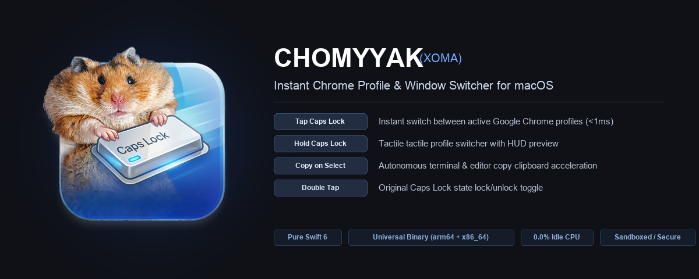

<p align="center">
  
</p>

# Chomyyak (Choma / Хома) — v1.0.0

A lightweight, zero-latency macOS productivity suite built in pure native Swift 6 and SwiftUI.

> **“Tap the Hamster. Own the Flow.”**  
> *«Тапни хомяка — войди в поток.»*

Eliminates workflow friction with driverless Caps-Lock remapping, instant Chrome profile cycling, multi-app toolkit switching (Terminal, IDE, AI Agent, Notes), and Linux/X11-style universal Copy-on-Select.

---

## ⚡ Key Features

### 🐹 1. Dual-Role Caps-Lock Hyper Key
<p align="center">
  
</p>

- **Tapped Alone (< 200ms)**: Synthesizes `Escape` key (`0x35`). Essential for Vim users, terminal commands, and dismissing modals.
- **Held Down**: Acts as `Hyper` modifier (`Shift + Control + Option + Command`) without toggling the Caps-Lock LED.
- **Driverless CoreGraphics**: Zero third-party drivers or background daemons (`CGEventTap` and `IOHID`).

### 🌐 2. Chrome Multi-Profile Switcher (`Caps-Lock + C`)
<p align="center">
  
</p>

- **Instant Cycling**: Rapidly cycle between open Google Chrome profile windows without touching the mouse.
- **Direct Jump (`Caps + 1..4`)**: Jump directly to a profile slot by index.
- **Dynamic Discovery**: Reads `~/Library/Application Support/Google/Chrome/Local State` with authentic profile avatars and account badges.
- **Zero Tab Clutter**: Native macOS Accessibility API integration—focuses existing windows without AppleScript delays or blank tabs.

### 🛠️ 3. 5-App Toolkit Fast Switcher
<p align="center">
  
</p>

- **Home-Row Letter Shortcuts**:
  - `Caps + T` ➔ **Terminal** (iTerm2, Ghostty, Alacritty, Terminal)
  - `Caps + I` ➔ **IDE** (VS Code, Cursor, Xcode, JetBrains)
  - `Caps + A` ➔ **AI Agent** (Claude, ChatGPT, Perplexity)
  - `Caps + N` ➔ **Notes** (Obsidian, Apple Notes, Notion)
  - `Caps + C` ➔ **Chrome Profiles**
- **Sub-16ms Execution**: Direct native window focus in 1 display frame.

### 📋 4. Universal Linux/X11 Copy-on-Select
<p align="center">
  
</p>

- **Drag-to-Copy**: Highlight text with mouse drag (>10pt distance) to automatically copy to clipboard.
- **Multi-Click Selection**: Double-click a word or triple-click a line to copy immediately.
- **Universal & Driverless**: Operates seamlessly across browsers, code editors, PDF viewers, and terminals. Toggle anytime via the menu bar icon.

---

## 📦 Building & Installation

### Quick Build
```bash
# Build universal binary (arm64 & x86_64) and DMG
make native

# Run test suite
make test

# Install to /Applications
make install
```

---

## 📊 Observability & Diagnostics

Chomyyak emits structured logs directly to Apple's **macOS Unified Logging System (`os_log`)** under subsystem `com.almosteleven.chomyyak`.

### Stream Logs in Real Time
```bash
make monitor
# or
./scripts/monitor_telemetry.sh stream
```

### Telemetry Summary & Error Analysis
```bash
make diagnostics
# or
./scripts/monitor_telemetry.sh summary 1h
```

---

## 🧪 Testing & Verification

```bash
# Run automated Swift unit tests
make test
# or
swift test

# Run 3-point system health check
make health
```

---

## 🎨 Brand Identity & Neuroaesthetics

Chomyyak's design and visual hierarchy are grounded in empirical cognitive neuroscience and neuroaesthetics.
- See the complete [Neuroaesthetics Brandbook](file:///Users/igorekishev/Igor/igorekishev/mac-productivity-suite/docs/BRANDBOOK_NEUROAESTHETICS.md).

---

## 📄 License
MIT License.
