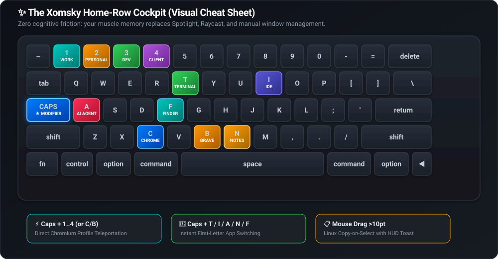

# Xomsky

[](https://github.com/unacau/mac-productivity-suite/releases/latest)
[](https://github.com/unacau/mac-productivity-suite)
[](LICENSE)

Zero-latency keyboard cockpit for macOS in pure native Swift 6. 
Jumps to Chrome/Brave profiles, switches pinned apps by first letter, and copies text on selection.

```bash
brew install unacau/tap/xomsky
```
*Or download **[Xomsky.dmg (1.8 MB)](https://github.com/unacau/mac-productivity-suite/releases/latest/download/Xomsky.dmg)**.*

---

## Shortcuts (Home-Row Cockpit)

<p align="center">
  
</p>

| Shortcut | Action | Target / Details |
| :--- | :--- | :--- |
| <kbd>Caps</kbd> + <kbd>1..4</kbd> | **Direct Profile Jump** | Instant jump to Chromium profile slot 1, 2, 3, or 4 |
| <kbd>Caps</kbd> + <kbd>C</kbd> / <kbd>B</kbd> | **Profile Cycle** | Cycle Google Chrome (`C`) or Brave (`B`) profiles with HUD |
| <kbd>Caps</kbd> + <kbd>T</kbd> | **Terminal** | Ghostty, iTerm2, Alacritty, Terminal.app |
| <kbd>Caps</kbd> + <kbd>I</kbd> | **IDE** | Antigravity IDE, Cursor, VS Code, Xcode, JetBrains |
| <kbd>Caps</kbd> + <kbd>A</kbd> | **AI Agent** | Antigravity, Claude, ChatGPT |
| <kbd>Caps</kbd> + <kbd>N</kbd> | **Notes** | Obsidian, Apple Notes, Notion, Bear |
| <kbd>Caps</kbd> + <kbd>F</kbd> | **Finder** | Focus macOS file manager |
| **Select Text (>10pt)** | **Copy-on-Select** | Auto-copies on mouse release with cursor toast |

*Repeated taps on an app shortcut cycle through open windows of that application.*

---

## Under the Hood

* **Driverless Remap:** Physical Caps Lock is remapped to `F18` via `/usr/bin/hidutil`. No green LED, no accidental uppercase.
* **Sub-16ms Latency:** Head-insert `CGEventTap` intercepts hotkeys before the window server for single-frame switching.
* **Reliable Profile Switching:** Uses native macOS Accessibility (`kAXMenuBarAttribute`) on the browser's "Profiles" menu, not fragile window title regexes.
* **100% Local & Lightweight:** Zero telemetry/network calls, ~15 MB RAM, 0% idle CPU. Resets keyboard layout on exit.

---

## Build & Diagnostics

```bash
# Build & install from source
make native install

# Run test suite (99 tests)
make test

# Stream local diagnostics (os_log)
make monitor
```

## Uninstall

```bash
brew uninstall xomsky   # or remove /Applications/Xomsky.app
```

---

## License

MIT © [Igor Ekishev](https://github.com/unacau)
