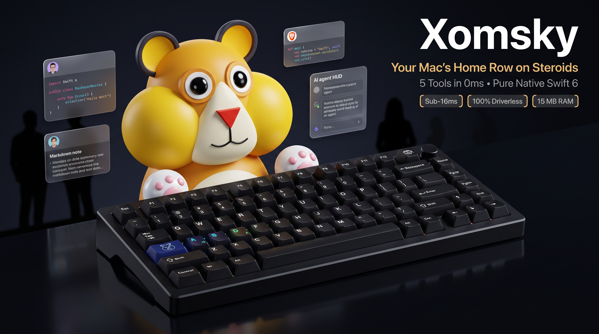

<p align="center">
  
</p>

<p align="center">
  <strong>Instant app switching by first letter • Sample-accurate Chromium profile jumping • Linux-style Copy-on-Select</strong><br>
  <em>100% Driverless Swift 6 • Sub-16ms Latency • Zero Kernel Extensions • 1.8 MB Footprint</em>
</p>

<p align="center">
  <a href="https://github.com/unacau/mac-productivity-suite/releases/latest"></a>
  <a href="https://swift.org"></a>
  <a href="#"></a>
  <a href="https://github.com/unacau/mac-productivity-suite/releases/latest/download/Xomsky.dmg"></a>
  <a href="#"></a>
  <a href="#"></a>
  <a href="LICENSE"></a>
</p>

<p align="center">
  <a href="https://github.com/unacau/mac-productivity-suite/releases/latest/download/Xomsky.dmg"><b>⬇️ Download DMG (1.8 MB)</b></a> •
  <a href="#-the-3-core-pains-solved"><b>⚡ 3 Core Pains</b></a> •
  <a href="#-the-5-key-home-row-cockpit"><b>✨ 5-Key Cockpit</b></a> •
  <a href="#%EF%B8%8F-benchmark-matrix"><b>🏎️ Benchmark</b></a> •
  <a href="#-quickstart"><b>🚀 Quickstart</b></a>
</p>

---

```bash
# Install via Homebrew in one command
brew install unacau/tap/xomsky
```

**Xomsky** turns your keyboard's home row into a zero-latency control center. Built in pure native **Swift 6**, it solves the three biggest window-management and clipboard bottlenecks in macOS:

1. **Direct Chromium Profile Windows (`Caps + C/B + 1..4`)**: Raise specific Work, Dev, or Personal browser profile windows without touching your mouse or cycling blind tabs.
2. **First-Letter App Switching (`Caps + Initial`)**: Jump to Terminal (`T`), IDE (`I`), AI Agent (`A`), Notes (`N`), or Finder (`F`) in under 16ms without typing in Spotlight or Raycast.
3. **Universal Copy-on-Select**: Highlight text with your mouse (>10pt) and release—it is copied to your clipboard instantly with an unobtrusive HUD toast.

---

## ⚡ The 3 Core Pains Solved

### 1. The Killer Feature: Multi-Profile Browser Windows (`Caps + C/B + 1..4`)

<p align="center">
  
</p>

* **The Problem:** In macOS, `Cmd + Tab` treats Google Chrome, Brave, and Edge as a single monolithic process. If you juggle 3–5 profiles (Work, Client, Personal, Staging), standard window cycling (`Cmd + \``) forces you to cycle blind across dozens of windows and spaces. Reaching for the profile avatar requires high-friction mouse navigation.
* **The Xomsky Fix:** Hold <kbd>Caps</kbd> and tap <kbd>C</kbd> (Chrome) or <kbd>B</kbd> (Brave) to cycle profiles, or tap <kbd>Caps</kbd> + <kbd>1..4</kbd> to jump straight to profile slot 1, 2, 3, or 4.
* **Under the Hood:** Automates profile window focus via native macOS Accessibility (`AXUIElement`) menu bar inspection. Reads avatar monograms directly from Chromium's local state. Zero AppleScript lag, zero tab recreation.

---

### 2. Mnemonic First-Letter App Switching (`Caps + [Initial]`)

<p align="center">
  
</p>

* **The Problem:** Traditional app switchers require opening a search overlay (Spotlight, Raycast, Alfred), typing characters (`"t-e-r-m"`, `"c-o-d-e"`), and hitting Return. Every switch demands visual attention, interrupts mental flow, and creates modal UI flicker.
* **The Xomsky Fix:** Pure muscle memory. Hold <kbd>Caps</kbd> with your left pinky and tap the first letter of the application category:
  * <kbd>Caps</kbd> + <kbd>T</kbd> ➔ **Terminal** (Ghostty, iTerm2, Alacritty, Terminal.app)
  * <kbd>Caps</kbd> + <kbd>I</kbd> ➔ **IDE** (Antigravity IDE, Cursor, VS Code, Xcode, JetBrains)
  * <kbd>Caps</kbd> + <kbd>A</kbd> ➔ **AI Agent** (Antigravity, Claude, ChatGPT)
  * <kbd>Caps</kbd> + <kbd>N</kbd> ➔ **Notes** (Obsidian, Apple Notes, Notion, Bear)
  * <kbd>Caps</kbd> + <kbd>F</kbd> ➔ **Finder**
* **Dynamic Ring Cycling:** Tapping the same key repeatedly cycles between candidate windows in that slot smoothly.

---

### 3. Eliminating 1,000 Wasted Keystrokes: Universal Copy-on-Select

<p align="center">
  
</p>

* **The Problem:** When you select text with a cursor, you intend to copy it 99% of the time. Pressing <kbd>Cmd</kbd> + <kbd>C</kbd> repeatedly throughout the workday causes cumulative wrist fatigue and wasted micro-movements.
* **The Xomsky Fix:** Linux/X11-style automatic clipboard copying. Drag-select text (>10pt) or double/triple-click words or paragraphs—releasing the mouse copies the text to `NSPasteboard` immediately.
* **Tactile Feedback:** A lightweight, non-activating HUD toast (`CopyToastWindow`) follows your cursor to confirm character count and auto-dismisses in <1.2s.
* **Safety Invariants:** Dragging while holding <kbd>Cmd</kbd> or <kbd>Ctrl</kbd> is ignored to preserve multi-cursor editor selection. Trivial clicks (<10pt) are never registered.

---

### 4. Dedicated Hardware Navigation Modifier (Zero Green LED Blink)

<p align="center">
  
</p>

* **Driverless IOHID Remapping:** Xomsky remaps physical <kbd>Caps Lock</kbd> to hardware keycode `F18` using Apple's native `/usr/bin/hidutil` property matching (`UserKeyMapping`).
* **Zero Green LED & No ALL CAPS:** Because <kbd>Caps Lock</kbd> is remapped at the hardware level, macOS never engages Alpha Lock. The green LED never blinks, and you will never accidentally type in uppercase.
* **Head-Insert CGEventTap:** Key combinations are captured at the CoreGraphics event tap level before reaching the window server, delivering consistent sub-16ms response times.
* **Zero System Bloat:** No virtual keyboard drivers, no kernel extensions, and no background daemon processes. Factory defaults are restored automatically when Xomsky quits.

---

## ✨ The 5-Key Home-Row Cockpit

| Key Combination | Category | Supported Applications | Behavior |
| :--- | :--- | :--- | :--- |
| <kbd>Caps</kbd> + <kbd>C</kbd> | **Chrome Profiles** | Google Chrome | Cycle Chrome profile windows in sub-16ms |
| <kbd>Caps</kbd> + <kbd>B</kbd> | **Brave Profiles** | Brave Browser | Cycle Brave profile windows in sub-16ms |
| <kbd>Caps</kbd> + <kbd>1..4</kbd> | **Direct Profile Jump** | Active Chromium Browser | Jump straight to profile slot 1, 2, 3, or 4 |
| <kbd>Caps</kbd> + <kbd>T</kbd> | **Terminal** | Ghostty, iTerm2, Alacritty, Terminal.app | Focus active terminal; tap to cycle instances |
| <kbd>Caps</kbd> + <kbd>I</kbd> | **IDE** | Antigravity IDE, Cursor, VS Code, Xcode, JetBrains | Raise code workspace across macOS spaces |
| <kbd>Caps</kbd> + <kbd>A</kbd> | **AI Agent** | Antigravity, Claude, ChatGPT | Summon reasoning companion without losing context |
| <kbd>Caps</kbd> + <kbd>N</kbd> | **Notes** | Obsidian, Apple Notes, Notion, Bear | Fast scratchpad access under your fingers |
| <kbd>Caps</kbd> + <kbd>F</kbd> | **Files** | Finder (`com.apple.finder`) | Summon system file manager |

> [!TIP]
> **Customizable Pinned Slots:** Prefer Obsidian for notes and Ghostty for terminal? Xomsky automatically prioritizes running tools and allows pin customization via the menu bar catalog.

---

## 🏎️ Benchmark Matrix

| Feature / Metric | Xomsky 🐹 | Raycast / Alfred | Karabiner-Elements | AltTab / Magnet |
| :--- | :---: | :---: | :---: | :---: |
| **Chromium Profile Direct Jump (`Caps + 1..4`)** | **YES (Sub-16ms)** | ❌ (Window title search only) | ❌ (No profile awareness) | ❌ (Flat window list) |
| **Dynamic Browser Switch (`C` / `B` / `E`)** | **YES (Auto-detects)** | ❌ | ❌ | ❌ |
| **Mnemonic First-Letter App Switching** | **Instant (Zero search bar)** | ⚠️ (Requires text input) | ⚠️ (Complex JSON config) | ❌ (Sequential tab order) |
| **Universal Linux Copy-on-Select** | **YES (With tactile HUD toast)**| ❌ | ❌ | ❌ |
| **Driverless (Zero Kext / Virtual HID)** | **100% Native Driverless** | 100% Driverless | ❌ (Virtual HID driver) | 100% Driverless |
| **Caps-Lock Green LED Suppressed** | **YES (Clean hardware remap)** | ❌ (Toggles or blinks) | ⚠️ (Driver-dependent) | ❌ |
| **Binary / DMG Size** | **1.8 MB** | ~80 MB – 120 MB | ~30 MB – 50 MB | ~15 MB – 25 MB |
| **RAM Footprint** | **~15 MB** | 150 MB – 350 MB | 40 MB – 80 MB | 50 MB – 100 MB |
| **Switch Latency** | **< 16 ms (1 frame)** | 80 ms – 250 ms | N/A | 50 ms – 120 ms |
| **Telemetry & Privacy** | **100% Local / Zero Tracking** | Cloud sync / Account | Local Only | Local Only |
| **License** | **MIT Open Source** | Freemium ($8+/mo Pro) | Open Source | Open Source / Paid |

---

## 🚀 Quickstart

### Method 1: Install via Homebrew (Recommended)

```bash
brew install unacau/tap/xomsky
```

### Method 2: Pre-built Universal DMG

1. Download **[Xomsky.dmg (1.8 MB)](https://github.com/unacau/mac-productivity-suite/releases/latest/download/Xomsky.dmg)**.
2. Drag `Xomsky.app` into `/Applications` and launch it.
3. Grant **Accessibility** permission (*System Settings ➔ Privacy & Security ➔ Accessibility*).

### Method 3: Build from Source

```bash
git clone https://github.com/unacau/mac-productivity-suite.git
cd mac-productivity-suite

make native install   # Compiles universal Mach-O binary and installs to /Applications
make test             # Executes all 99 unit tests with Swift 6 strict concurrency
```

---

## 📊 Privacy, Diagnostics & Local Telemetry

Xomsky does not transmit any usage data, analytics, or keystrokes to remote servers. All telemetry is recorded locally using Apple's **macOS Unified Logging System (`os_log`)** under subsystem `com.almosteleven.xomsky`.

You can inspect or stream diagnostics at any time:

```bash
make monitor       # Stream live event logs in real time
make diagnostics   # View hourly event distribution and latency metrics
make health        # Run 3-point system validation check
```

Need to report an issue? Use the built-in **Report Issue** window in the menu bar to generate a sanitized diagnostic ZIP bundle that you can drag directly into GitHub or any messaging app.

---

## ❓ Frequently Asked Questions

<details>
<summary><b>Does Xomsky require disabling System Integrity Protection (SIP) or installing kernel extensions?</b></summary>
<br>

**No.** Xomsky is completely driverless. It configures hardware remapping through Apple’s built-in `/usr/bin/hidutil` and intercepts navigation hotkeys through standard CoreGraphics event taps (`CGEventTap`). It requires only standard macOS Accessibility permissions.
</details>

<details>
<summary><b>What happens to the Caps Lock key when Xomsky is running?</b></summary>
<br>

Physical <kbd>Caps Lock</kbd> is remapped to keycode `F18`. The macOS green LED never lights up, and text will never unexpectedly toggle to ALL CAPS. When you quit Xomsky, your original keyboard configuration is restored immediately.
</details>

<details>
<summary><b>How does Chromium profile window detection work?</b></summary>
<br>

Unlike fragile scripts that match window titles (which fail whenever web pages change their title), Xomsky navigates the browser's native macOS menu bar (`kAXMenuBarAttribute`) via Accessibility APIs. It parses the browser's "Profiles" menu, identifies active markers (`✓`), and raises the target window by exact index.
</details>

<details>
<summary><b>How do I uninstall Xomsky?</b></summary>
<br>

Quit Xomsky from the menu bar item, then delete `/Applications/Xomsky.app`. All keyboard mappings reset to factory defaults upon termination. If installed via Homebrew, run:
```bash
brew uninstall xomsky
```
</details>

---

## 📄 License

Distributed under the **MIT License**. See [LICENSE](LICENSE) for details.
