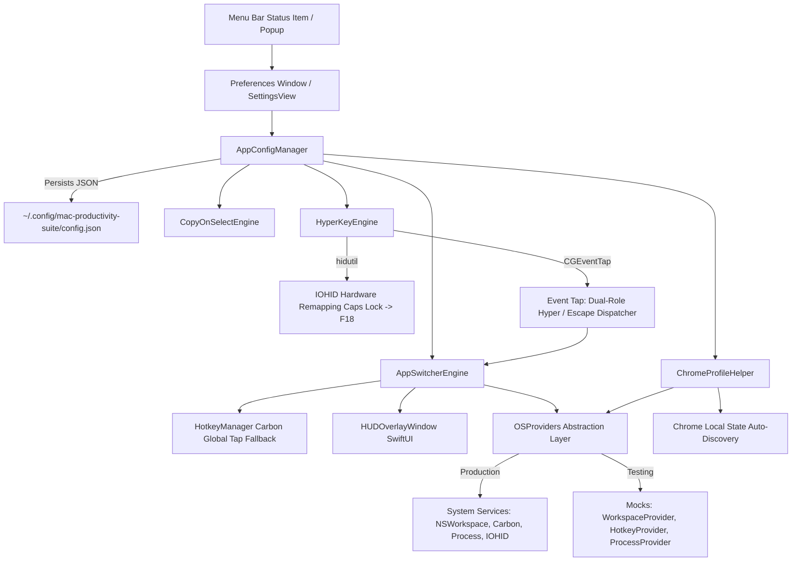

# Mac Productivity Suite Design (v2.0 Universal)

## Objective
Provide a universal, high-performance productivity platform for macOS combining a **Pure Native Standalone Swift App** and an optional **Hammerspoon / Karabiner scripted engine**. The suite provides instant application switching, dynamic multi-profile browser switching, global copy-on-select, dual-column Finder tiling, and markdown note highlights.

---

## Key Features

1. **Universal App Switcher & Multi-Candidate Launcher**:
   - Single-key global switching (e.g. `⌥⌘ + I`, `Caps Lock + I`).
   - Supports multi-candidate resolution: automatically detects installed terminal emulators (`Ghostty`, `iTerm`, `Warp`, `Alacritty`, `Terminal`), code editors (`Cursor`, `VS Code`, `Xcode`, `Zed`), browsers, and chat apps.
   - Beautiful visual HUD overlay with real application icons and instant keyboard cycling.

2. **Automatic Browser Profiles Discovery**:
   - Dynamically parses `~/Library/Application Support/Google/Chrome/Local State` (and Brave, Edge, Chromium) without any hardcoded names or email addresses.
   - Extracts circular profile avatars, names, and account labels.
   - Binds instant numeric switcher keys (`1..4` / `1..N`).

3. **Global Copy on Select**:
   - Automatically copies highlighted or double-clicked text to clipboard with configurable drag thresholds.
   - Smart exclusion list for terminal emulators and customizable user apps.

4. **Interactive Preferences & Customization UI (SwiftUI)**:
   - Full Settings window (`⌘,`) with searchable application picker (`AppPickerSheet`).
   - 1-click "Auto-Detect My Apps" feature scanning `/Applications` and `~/Applications`.
   - Workflow presets: Developer, Everyday Mac, Creative & Media, Minimalist.
   - Export / Import configuration to JSON (`~/.config/mac-productivity-suite/config.json`).

5. **Productivity Power Actions**:
   - **Finder Dual-Column Split (`⌥⌘⌃ + F`)**: Instantly creates side-by-side synchronized Finder windows in column view.
   - **Highlight to Quick Notes (`⌘⇧ + H`)**: Formats selected text with timestamp and app/URL context into Markdown.

---

## Architecture & Components
 

### 1. Configuration & Core Engines (`src/NativeStandaloneApp/Engine/`)
- `HyperKeyEngine.swift`: 100% driverless native Caps Lock to Hyper (held) and Escape (tapped alone) dual-role engine. Eliminates Karabiner-Elements, Caps Lock delay, and green LED locking.
- `AppConfig.swift`: Codable configuration models, preset definitions, and persistence manager. Supports `MPS_TEST_CONFIG_DIR` sandbox override.
- `OSProviders.swift`: Abstracted OS protocols (`WorkspaceProvider`, `HotkeyProvider`, `ProcessProvider`, `RunningAppProvider`) enabling deterministic, headless dependency injection.
- `AppDiscoveryService.swift`: Scans macOS applications, resolves icons, and builds smart bindings.
- `ChromeProfileHelper.swift`: Dynamic profile detection and CLI/AppleScript activation.
- `AppSwitcherEngine.swift`: Global hotkey dispatcher, candidate resolution, and HUD coordinator.
- `CopyOnSelectEngine.swift`: Native Swift global event monitor for Linux/X11-style drag-selection copying (eliminating Hammerspoon).
- `HotkeyManager.swift`: Carbon event handler for high-performance global key registration.

### 2. User Interface (`src/NativeStandaloneApp/Views/`)
- `MenuBarPopupView.swift`: Quick status item popup with active shortcuts overview.
- `SettingsWindow.swift`: Tabbed preferences window for full customization.
- `AppPickerSheet.swift`: Searchable app browser modal with live icons.
- `HUDOverlayWindow.swift`: Floating glass HUD overlay.

### 3. Scripted Engine (`hammerspoon/`)
- `init.lua`: Dynamic JSON configuration loader and hot-reloader.
- `app_switcher.lua`: Lua app switcher with multi-app HUD canvas.
- `chrome_profiles.lua`: Dynamic `Local State` parser in Lua.
- `copy_on_select.lua`: Eventtap-based copy on select.

### 4. Automated Testing Architecture (`tests/`)
- **Unit Testing Suite (`tests/SwiftUnitTests.swift` / `MacProductivitySuiteTests`)**:
  - Validates configuration serialization/deserialization, virtual keycode mapping, profile parsing, and exclusion rule lists.
- **Integration Testing Suite (`tests/IntegrationTests/` / `MacProductivitySuiteIntegrationTests`)**:
  - `ConfigIntegrationTests.swift`: Verifies seamless legacy configuration migration and multi-version schema upgrades.
  - `ChromeProfileIntegrationTests.swift`: Tests multi-profile discovery from mocked Chromium `Local State` payloads and profile CLI invocation argument synthesis.
  - `AppSwitcherIntegrationTests.swift`: Tests mock hotkey event dispatching, multi-candidate HUD cycling, and fallback application launching across decoupled workspace providers.
- **Test Runner (`tests/run_tests.sh`)**:
  - Orchestrates SPM unit & integration tests along with Lua syntax checks for Hammerspoon scripts.
