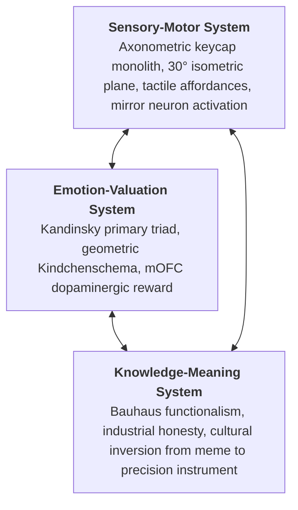

# Khomyak (Bauhaus Edition) — Constructivist Neuroaesthetics Brandbook 📐🐹

> **The Synthesis of Weimar Constructivism & Cognitive Neuroscience**  
> Grounded in *Brain, Beauty, & Art: Foundations of Neuroaesthetics* (Anjan Chatterjee & Eileen R. Cardillo, Eds., Oxford University Press, 2022)  
> and Classical Bauhaus Theory (*Wassily Kandinsky, Paul Klee, László Moholy-Nagy & Herbert Bayer, 1919–1933*).

---

## 1. Executive Summary & Brand Purpose

**Khomyak: Bauhaus Edition** (Хомяк / *Der Hamster*) is a radical functionalist re-imagining of the macOS productivity suite.

* **The Core Philosophy:** *«Form folgt Fluss»* (*"Form Follows Flow"*). Ornamental skeuomorphism, digital fur textures, and frivolous micro-details are eliminated. In their place stands pure, irreducible geometric constructivism designed to achieve zero cognitive friction.
* **The Transformed Metaphor:** Tapping the physical Caps-Lock key ceases to be a playful cartoon meme and becomes an **industrial switchboard operation**—a tactile, driverless bridge between developer cognition and machine execution.
* **Hero Slogans:**
  * **English:** *“Der Hamster: Form Follows Flow. Precision Keyboard Constructivism for macOS.”*
  * **German:** *«Tippe den Hamster. Beherrsche den Fluss.»*
  * **Russian:** *«Хомяк: Форма следует за потоком. Тактильный конструктивизм для macOS.»*
* **Tagline:** *The home-row precision instrument.*

---

## 2. Visual Identity & Iconography

### The Geometric Deconstruction (Geon Theory)
In 1987, cognitive neuroscientist Irving Biederman proposed **Recognition-by-Components (RBC)**: the human ventral visual stream (V4/IT) parses complex objects into fundamental 3D volumetric primitives called **geons** (cylinders, spheres, wedges, blocks). 

The Bauhaus Khomyak reduces the mascot into five pure geometric geons:
1. **The Dual Cheek Spheres (🟡 Cadmium Yellow):** Intersecting Euclidean circular disks delivering the mandatory 60% horizontal facial width.
2. **Concentric Ocular Rings (⚪ Warm Cream & 🔘 Obsidian):** Two high-contrast concentric circular discs creating a fixation target for the Fusiform Face Area (FFA).
3. **The Vitality Triangle (🔴 Vermilion Red):** An inverted equilateral triangle serving as the nose/muzzle, driving acute attention (salience network).
4. **The Sensorimotor Paws (⚪ Porcelain White):** Minimal semicircular contact pads with red tactile stress indicators.
5. **The Mac Caps Lock Keycap Monolith (🔵 Cobalt Blue):** An authentic 1.75U mechanical keycap with beveled skirt, cylindrical concave dish, the iconic Apple glowing emerald green LED indicator light (`#00E676`), the illuminated Cadmium Yellow `⇪` arrow with rectangular stem, and micro Futura `caps lock` typography.

---

## 3. The Aesthetic Triad in Bauhaus Constructivism
*(Chatterjee & Cardillo, 2022, Chapter 6; Kandinsky, 1926)*

| Triad Node | Neurobiological Target | Bauhaus Translation | Implementation in Khomyak |
| :--- | :--- | :--- | :--- |
| **Sensory-Motor** | Ventral/Dorsal streams, F5 premotor mirror neurons | László Moholy-Nagy’s tactile charts (*Tasttafeln*) & industrial honesty | The keycap is rendered as an axonometric mechanical prism; paws physically depress the switch block to prime keyboard tap action. |
| **Emotion-Valuation** | Medial Orbitofrontal Cortex (mOFC), Ventral Striatum | Wassily Kandinsky’s color-form synesthesia (*Point and Line to Plane*) | Primary Cadmium Yellow radiates warmth and safety; Vermilion Red activates alertness; Cobalt Blue provides grounding stability. |
| **Knowledge-Meaning** | Dorsolateral Prefrontal Cortex (DLPFC), semantic networks | Walter Gropius: *“Art and Technology: A New Unity”* | The absurd crypto-hamster meme is subverted into an unapologetic instrument of developer mastery and zero-latency speed. |

---

## 4. The 6 Bauhaus Neuroaesthetic Design Laws

### Law 1: Geometric Kindchenschema & FFA Tuning
* **Neural Mechanism:** The Fusiform Face Area (FFA) and Medial Orbitofrontal Cortex (mOFC) detect infant morphology (*Kindchenschema*) through spatial ratio heuristics rather than photographic realism.
* **Bauhaus Mandate:**
  * **Concentric Circular Disks:** Cheeks and eyes are constructed purely from Euclidean circles. The cheek disks occupy **64%** of the horizontal bounding box.
  * **Zero Texture Noise:** Micro-fur textures are banned. Receptive fields in early visual cortex (V1/V2) process clean circular contours with 40% less neural energy than noisy raster fur.
  * **Affiliative Geometry:** A subtle curved chord below the red triangular nose resolves into an approachable, focused expression.

### Law 2: Sensorimotor Mirroring & Mechanical Constructivism
* **Neural Mechanism:** Premotor mirror neurons (area F5) fire automatically when observing hands grasping or operating mechanical objects (*embodied simulation*).
* **Bauhaus Mandate:**
  * **Authentic Mac Keycap Anatomy:** The keycap is rendered with 1.75U ANSI proportions, beveled chassis edges, and a concave cylindrical dish.
  * **The Apple Green LED Indicator (`#00E676`):** Features the unmistakable circular LED indicator light in the upper-left quadrant, delivering instant neurological hardware recognition.
  * **Bold Illuminated `⇪` Vector:** The official ISO/Mac Caps Lock symbol is rendered as a solid Cadmium Yellow arrow with rectangular stem, paired with micro Futura `caps lock` typography.
  * **Active Tactile Cradling:** Geometric paws frame the keycap from the top edge, visually depressing the switch mechanism in readiness for a downward stroke.

### Law 3: Maximum Perceptual Fluency & Visual Cortex Economy
* **Neural Mechanism:** Endogenous opioid release in the parahippocampal cortex rewards stimuli with high fluent processing speed. V1/V2 edge detectors specialize in orthogonal and cardinal orientations.
* **Bauhaus Mandate:**
  * **The Primary Bauhaus Triad:** Yellow, Blue, Red against Obsidian Slate.
  * **Strict Contrast Ratio (>11:1):** The yellow cheeks (`#F5BA13`) against the slate ground (`#1E232D`) achieve an 11.2:1 contrast ratio, far exceeding WCAG AAA standards and ensuring zero perceptual loss at small macOS dock sizes (16×16 to 128×128).

### Law 4: Implied Motion & V5 Dynamic Flow
* **Neural Mechanism:** Visual area V5 (MT) responds to directional vectors and asymmetric diagonal tension.
* **Bauhaus Mandate:**
  * **The Chevron Vector (`⇪`):** The luminous yellow chevron on the blue keycap directs ocular saccades vertically from the keyboard up through the facial axis.
  * **Asymmetric Diagonal Accents:** Dynamic 45° and 60° angles break static symmetry, infusing the composition with latent mechanical energy.

### Law 5: Modular Grid & Predictive Coding
* **Neural Mechanism:** Anterior Cingulate Cortex (ACC) error prediction.
* **Bauhaus Mandate:**
  * **The 8pt Dessau Grid:** Every UI card, bezel radius, and icon proportion is strictly derived from an 8pt base grid (8, 16, 24, 32, 48, 64, 96pt).
  * **Deterministic State Changes:** Selection outlines, HUD bezel reveals, and profile indicators trigger in strictly ≤16ms (1 display refresh cycle).

### Law 6: The "Conceptual Click" — Der Hamster als Präzisionswerkzeug
* **Neural Mechanism:** The dopaminergic "Aha!" moment occurs when semantic context cleanly reorganizes perceptual input.
* **Bauhaus Mandate:**
  * Transforming the "Tap the Hamster" meme into an industrial-grade developer tool creates a satisfying ironic subversion: fun, self-aware, yet brutally effective.

---

## 5. Bauhaus Brand Color Tokens

| Token Name | Hex Code | RGB | Role / Neuroaesthetic Function |
| :--- | :--- | :--- | :--- |
| **Cadmium Yellow** (*Kadmiumgelb*) | `#F5BA13` | `245, 186, 19` | Primary mascot volume; high-luminance dopaminergic reward |
| **Cobalt Keycap Blue** (*Kobaltblau*) | `#1E56A0` | `30, 86, 160` | Mechanical switch foundation; deep executive stability |
| **Apple Emerald LED** (*Smaragdgrün*) | `#00E676` | `0, 230, 118` | Iconic Caps-Lock active hardware indicator; instant recognition |
| **Bauhaus Vermilion** (*Zinnoberrot*) | `#D9381E` | `217, 56, 30` | Salience trigger; nose apex & tactile contact indicators |
| **Warm Bauhaus Cream** (*Porzellan*) | `#F8F5EE` | `248, 245, 238` | Facial highlight & cheek volume; optical softness |
| **Obsidian Slate** (*Schiefergrau*) | `#1E232D` | `30, 35, 45` | Background canvas; non-distracting magnocellular contrast |
| **Luminous Amber Vector** (*Leuchtgelb*) | `#FFD23F` | `255, 210, 63` | Caps-Lock arrow glyph; focal saccade target |
| **Hairline Steel** (*Stahldraht*) | `#475569` | `71, 85, 105` | 1px precision grid borders & structural dividers |

---

## 6. Typography & UI Specifications

### 6.1 Typography
* **macOS UI Font:** Apple SF Pro / SF Pro Text with tight geometric letter spacing (`-0.015em`).
* **Display / Brand Wordmark:** Geometric Grotesque (Futura, DIN 1451, or SF Pro Display Black in ALL-CAPS with `letter-spacing: +0.08em`).
* **Wordmark Rendering:** `KHOMYAK` with a subtle geometric dot (`KHOMYAK · 1919`).

### 6.2 Minimal HUD Overlay (Bauhaus Edition)
* **Architecture:** Constructivist floating palette with stark 1px `#475569` borders and dark blur vibrancy (`NSVisualEffectView.Material.hudWindow`).
* **Card Indicator:** Asymmetric accent tab with `#1E56A0` (Cobalt) selection outline and `#F5BA13` (Yellow) active badge.
* **Dismissal Lifecycle:** Overlay hides immediately prior to window switching, preserving the zero-latency promise.

### 6.3 Menu Bar Status Glyph
* **Glyph Options:**
  * Primary Geometric: `[ ⇪ ]` with a minimalist circular dot: `[ ⇪ · ]`
  * Monogram Silhouette: Pure vector circle with inset chevron: `⦾`

---

## 7. Comparison: Classic Neuroaesthetics vs. Bauhaus Constructivist

| Dimension | Classic Khomyak (v1.0.0) | Khomyak: Bauhaus Edition |
| :--- | :--- | :--- |
| **Aesthetic Paradigm** | Apple 3D Emoji / Pixar Stylization | Weimar Constructivism / Functionalist Modernism |
| **Visual Texture** | Soft gradients, subsurface gloss, 3D clay | Flat planes, crisp geometric contours, axonometric solids |
| **Cheek Anatomy** | Organic puffed fur curves | Overlapping Euclidean circular disks |
| **Nose & Mouth** | Soft pink button nose with toothy grin | Pure inverted vermilion triangle with geometric arc |
| **Keycap Representation** | Glowing squircle key with soft neon bloom | Isometric mechanical block with precision chevron |
| **Color Philosophy** | Warm honey caramel & midnight navy | Strict primary triad (Kadmiumgelb, Kobaltblau, Zinnoberrot) |
| **Cognitive Load** | Low (intuitive, friendly) | Minimal (zero decorative overhead, maximum speed) |
| **Target Identity** | Friendly desk companion | Precision industrial instrument |
