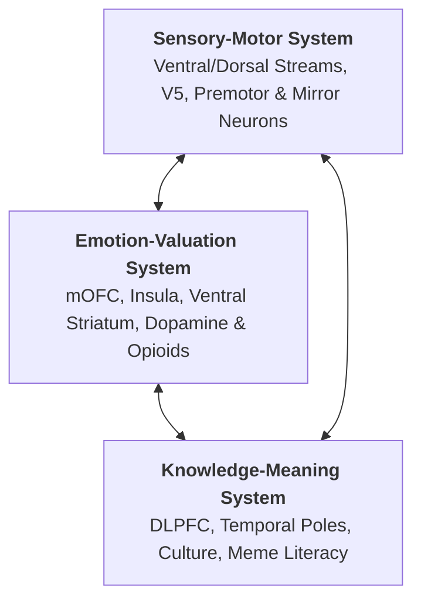

# Chomyak (Choma / Хома) — Neuroaesthetics Brandbook 🐹

> **Grounded in Cognitive Neuroscience & Empirical Aesthetics**  
> Based on *Brain, Beauty, & Art: Foundations of Neuroaesthetics* (Anjan Chatterjee & Eileen R. Cardillo, Eds., Oxford University Press, 2022).

---

## 1. Executive Summary & Brand Purpose

**Chomyak** (Choma / Хома) is a lightweight, zero-latency macOS productivity suite built in pure native Swift 6 and SwiftUI.

* **The Core Metaphor:** Tapping the physical Caps-Lock key replaces the futile mobile phone tap-to-earn meme with instantaneous developer flow state.
* **Primary Slogan:**
  > *«Тапни хомяка — войди в поток.»* (*“Tap the Hamster. Own the Flow.”*)
* **Tagline:** *Your Mac’s tactile home-row buddy.*

Neuroaesthetics demonstrates that visual aesthetic experiences are evolutionary prediction and reward mechanisms. By grounding Chomyak's visual identity in neuroscience, we optimize both optical legibility in macOS and neuromuscular habit formation on the keyboard.

---

## 2. The Theoretical Anchor: The Aesthetic Triad
*(Chapter 6: Vartanian & Chatterjee, pp. 49–52)*

The aesthetic experience emerges from the dynamic interaction of three interconnected neural networks:

Every visual and interactive expression of Chomyak must activate all three nodes:
1. **Sensory-Motor:** High figure-to-ground contrast (>7:1), curved 3D volumes, and tactile keycap manipulation that primes motor action.
2. **Emotion-Valuation:** Dopaminergic warmth and mOFC affiliative facial reward (*Kindchenschema*).
3. **Knowledge-Meaning:** Rapid cognitive resolution bridging internet culture (*"Тапни хомяка"*) with deep developer flow.

---

## 3. The 6 Core Neuroaesthetic Design Laws

### Law 1: Facial Reward & mOFC Activation (*Kindchenschema*)
*(Chapter 9: O'Doherty & Dolan, pp. 65–68; Chapter 10: pp. 70–73)*

* **Neural Mechanism:** The **Medial Orbitofrontal Cortex (mOFC)** automatically codes the reward value of faces even during passive viewing. Faces combining happy expressions with infant morphology (*Kindchenschema*) generate pronounced positive valuation signals.
* **Design Mandates:**
  * **The 60% Cheek Rule:** Chomyak’s puffed cheeks must account for at least 60% of the horizontal face width, evoking evolutionary cues of abundance, safety, and non-threatening companionship.
  * **High-Gloss Dark Eyes:** Large, dark, glossy eyes with crisp white reflections drive immediate ocular fixation in the Fusiform Face Area (FFA).
  * **Affiliative Expression:** Avoid deadpan or aggressive mascot styling. Chomyak maintains an open, friendly grin with subtle tooth display.

### Law 2: Sensorimotor Mirroring & Embodied Simulation
*(Chapter 18: Gallese, Freedberg & Umiltà, pp. 110–114)*

* **Neural Mechanism:** Viewing an image triggers **online bodily simulation** via the mirror neuron system. Observing a subject actively grasping or pressing a tactile object fires the beholder’s premotor cortex.
* **Design Mandates:**
  * **The Tactile Keycap Contact:** Chomyak is never depicted empty-handed. His paws must physically cradle the glowing keyboard keycap.
  * **Motor Priming:** The visual contact between tiny paws and the **`⇪`** keycap primes the user’s left hand to tap the Caps-Lock key.
  * **Mechanical Fidelity:** Keycaps must be rendered with realistic mechanical dishing, cylindrical top indentation, and beveled switch edges.

### Law 3: The Infovore Principle & Perceptual Fluency
*(Chapter 13: Vessel, Yue & Biederman, pp. 83–86; Chapter 2: pp. 30–34)*

* **Neural Mechanism:** The brain is an **infovore**—endogenous opioid receptors in the parahippocampal cortex release hedonic rewards when processing stimuli characterized by high fluency and low ambiguity. Competing micro-textures (e.g., individual fur strands at small scales) induce cognitive fatigue.
* **Design Mandates:**
  * **Macro Zoom & Scale:** The head and cheeks must fill 85%–95% of the squircle tile.
  * **Stylized 3D Volumes:** Use smooth, continuous gradient volumes (inspired by Apple 3D emojis and Pixar character modeling) rather than noisy micro-hair textures.
  * **Extreme Value Contrast (> 7:1):** Golden caramel and cream face elements set against a deep midnight-indigo ground (`#060B18`) ensure the silhouette never degrades into a muddy smudge at 16×16px or 32×32px.
  * **Curvature Dominance:** The ventral visual stream favors harmonic curves over sharp corners. All brand glyphs, icons, and HUD cards must utilize continuous Apple Bézier squircle geometry.

### Law 4: Implied Motion & Visual Area V5 Dynamic Flow
*(Chapter 22: Nadal & Cattaneo, pp. 129–133)*

* **Neural Mechanism:** Static visual artwork with **implied motion** selectively activates visual motion area **V5 (MT/V5)**, elevating perceived dynamism and engagement.
* **Design Mandates:**
  * **The Upward Vector (`⇪`):** The luminous upward arrow on the keycap functions as a vertical vector that naturally guides saccadic eye movements upward from the keycap to the hamster’s eyes.
  * **Snappy Spring Curves:** Interactive macOS UI animations (HUD bezel entry, tab transitions) must utilize low-latency spring curves (`response: 0.22s, dampingFraction: 0.78`) to maintain the feeling of physical mechanical response.

### Law 5: Architectural Affordances & Predictive Coding
*(Chapter 45: Djebbara & Gramann, pp. 252–255)*

* **Neural Mechanism:** The brain operates as an anticipatory predictive coding engine. When UI feedback violates timing expectations (>100ms lag), error-prediction signals fire in the anterior cingulate cortex (ACC).
* **Design Mandates:**
  * **Sub-16ms Execution:** Application switching and profile selection must execute within 1 display frame (≤16ms). Zero perceived latency preserves the illusion of physical hardware bridging.
  * **Visual State Confirmation:** The floating Minimal HUD window must immediately display selected app card outlines (`#82C8FA`) before key release.

### Law 6: The "Conceptual Click" of Meaning
*(Chapter 28: pp. 159–163; Chapter 35: pp. 199–203)*

* **Neural Mechanism:** Deep aesthetic satisfaction occurs when top-down contextual knowledge resolves sensory input (the "Aha!" reward).
* **Design Mandates:**
  * **Cultural Inversion:** The brand humorously inverts the passive smartphone screen tapping habit into an active keyboard superpower for developers.
  * **Tone of Voice:** Irreverent, ultra-fast, developer-first, and allergic to software bloat (zero Electron, zero background daemons).

---

## 4. Brand Color Tokens

| Token Name | Hex Code | RGB | Role / Neuroaesthetic Function |
| :--- | :--- | :--- | :--- |
| **Hamster Gold** | `#F5A623` | `245, 166, 35` | Primary brand accent; warm dopaminergic reward |
| **Cream Cheek** | `#FFF4E0` | `255, 244, 224` | *Kindchenschema* facial volume highlight |
| **Midnight Navy** | `#0B1120` | `11, 17, 32` | High-contrast background field (>10:1 luminous contrast) |
| **Keycap Glow** | `#E0F2FE` | `224, 242, 254` | Saccadic focus anchor; indicates active state |
| **Tactile Cyan** | `#38BDF8` | `56, 189, 248` | HUD selection ring & active profile indicator |
| **Nose Pink** | `#FB7185` | `251, 113, 133` | Biological warmth & center-of-face anchor |

---

## 5. Typography & UI Specifications

* **Primary macOS Font:** Apple SF Pro / SF Pro Rounded.
* **Menu Bar Status Item:** `(• ᴥ •)` micro-glyph or streamlined monochrome squircle silhouette.
* **HUD Overlay Dimensions:** Compact floating bezel with continuous corner radius (15pt inner, 20pt outer), dark blur vibrancy (`NSVisualEffectView`).
* **Dock Icon Asset:** `AppIcon.icns` rendered at standard Apple HIG proportions (824×824 squircle centered on a 1024×1024 transparent canvas with Gaussian elevation shadow).

---

## 6. Slogans & Copywriting Matrix

* **Hero Slogan:**
  * *«Тапни хомяка — войди в поток.»*
  * *“Tap the Hamster. Own the Flow.”*
* **Product Descriptions:**
  * *«Хомяк на Caps Lock: самый продуктивный тап в твоей жизни.»*
  * *“The driverless macOS hyper-key that turns the home row into your fastest workspace switch.”*
* **Developer One-Liner:**
  * *“Pure native Swift 6. Zero daemons. 100% flow.”*
