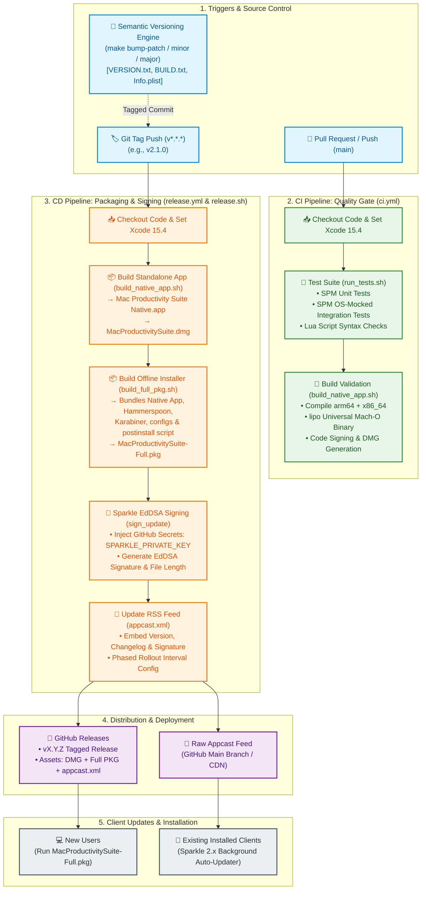

```mermaid
flowchart TD
    %% Styling and layout configuration
    classDef trigger fill:#e1f5fe,stroke:#0288d1,stroke-width:2px,color:#01579b;
    classDef ci fill:#e8f5e9,stroke:#388e3c,stroke-width:2px,color:#1b5e20;
    classDef cd fill:#fff3e0,stroke:#f57c00,stroke-width:2px,color:#e65100;
    classDef release fill:#f3e5f5,stroke:#7b1fa2,stroke-width:2px,color:#4a148c;
    classDef client fill:#eceff1,stroke:#455a64,stroke-width:2px,color:#263238;

    %% Triggers & Source Phase
    subgraph S1 ["1. Triggers & Source Control"]
        PR["🔀 Pull Request / Push (main)"]:::trigger
        TAG["🏷️ Git Tag Push (v*.*.*)\n(e.g., v2.1.0)"]:::trigger
        SEMVER["🔢 Semantic Versioning Engine\n(make bump-patch / minor / major)\n[VERSION.txt, BUILD.txt, Info.plist]"]:::trigger
        SEMVER -.->|Tagged Commit| TAG
    end

    %% CI Quality Gate Pipeline
    subgraph S2 ["2. CI Pipeline: Quality Gate (ci.yml)"]
        CHECKOUT1["📥 Checkout Code & Set Xcode 15.4"]:::ci
        TESTS["🧪 Test Suite (run_tests.sh)\n• SPM Unit Tests\n• SPM OS-Mocked Integration Tests\n• Lua Script Syntax Checks"]:::ci
        BUILD_TEST["🔨 Build Validation (build_native_app.sh)\n• Compile arm64 + x86_64\n• lipo Universal Mach-O Binary\n• Code Signing & DMG Generation"]:::ci

        PR --> CHECKOUT1
        CHECKOUT1 --> TESTS
        TESTS --> BUILD_TEST
    end

    %% CD Build & Package Pipeline
    subgraph S3 ["3. CD Pipeline: Packaging & Signing (release.yml & release.sh)"]
        CHECKOUT2["📥 Checkout Code & Set Xcode 15.4"]:::cd
        BUILD_APP["📦 Build Standalone App (build_native_app.sh)\n→ Mac Productivity Suite Native.app\n→ MacProductivitySuite.dmg"]:::cd
        BUILD_PKG["📦 Build Offline Installer (build_full_pkg.sh)\n→ Bundles Native App, Hammerspoon,\nKarabiner, configs & postinstall script\n→ MacProductivitySuite-Full.pkg"]:::cd
        SPARKLE_SIGN["🔐 Sparkle EdDSA Signing (sign_update)\n• Inject GitHub Secrets: SPARKLE_PRIVATE_KEY\n• Generate EdDSA Signature & File Length"]:::cd
        UPDATE_FEED["📝 Update RSS Feed (appcast.xml)\n• Embed Version, Changelog & Signature\n• Phased Rollout Interval Config"]:::cd

        TAG --> CHECKOUT2
        CHECKOUT2 --> BUILD_APP
        BUILD_APP --> BUILD_PKG
        BUILD_PKG --> SPARKLE_SIGN
        SPARKLE_SIGN --> UPDATE_FEED
    end

    %% Release & Distribution Phase
    subgraph S4 ["4. Distribution & Deployment"]
        GH_RELEASE["🚀 GitHub Releases\n• vX.Y.Z Tagged Release\n• Assets: DMG + Full PKG + appcast.xml"]:::release
        APPCAST_RAW["📡 Raw Appcast Feed\n(GitHub Main Branch / CDN)"]:::release

        UPDATE_FEED --> GH_RELEASE
        UPDATE_FEED --> APPCAST_RAW
    end

    %% End-User Updates Phase
    subgraph S5 ["5. Client Updates & Installation"]
        INSTALLER["💻 New Users\n(Run MacProductivitySuite-Full.pkg)"]:::client
        AUTOUPDATE["🔄 Existing Installed Clients\n(Sparkle 2.x Background Auto-Updater)"]:::client

        GH_RELEASE --> INSTALLER
        APPCAST_RAW --> AUTOUPDATE
    end
```