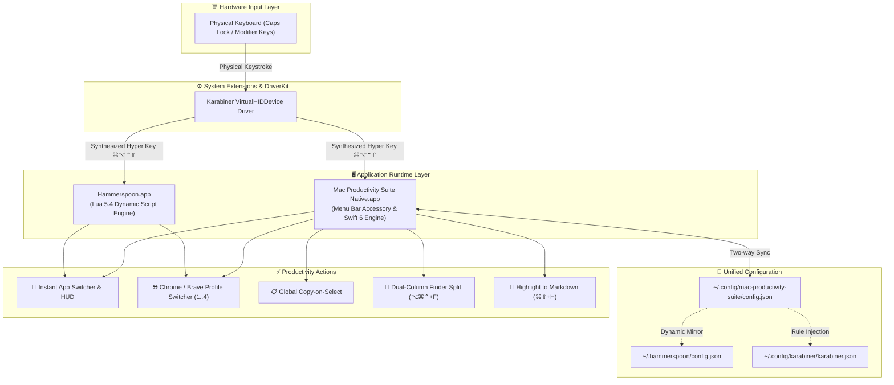
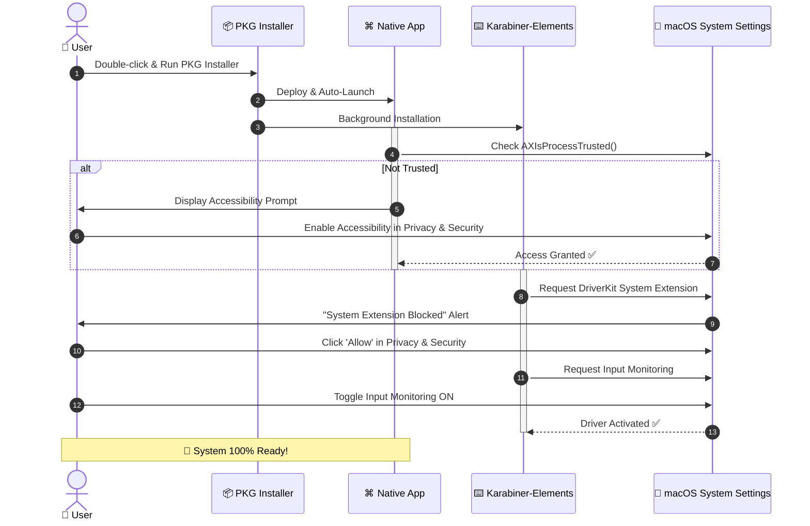

# 🚀 Mac Productivity Suite — Complete Installation & Permissions Guide

<div align="center">


-blue?style=for-the-badge)


<p align="center">
  <b>A comprehensive, step-by-step visual onboarding guide explaining every installed component, architectural interaction, and system permission required for the Mac Productivity Suite.</b>
</p>

---

</div>

## 📑 Table of Contents

- [1. Overview & Architecture](#1-overview--architecture)
- [2. Component Breakdown: What Gets Installed & Why](#2-component-breakdown-what-gets-installed--why)
- [3. Full vs. Native Standalone Editions](#3-full-vs-native-standalone-editions)
- [4. Step-by-Step Installation Walkthrough](#4-step-by-step-installation-walkthrough)
- [5. macOS Permissions Deep Dive (Security & Transparency)](#5-macos-permissions-deep-dive-security--transparency)
- [6. Permission Setup Flowchart](#6-permission-setup-flowchart)
- [7. Post-Installation Verification & First Steps](#7-post-installation-verification--first-steps)
- [8. Troubleshooting & Diagnostics](#8-troubleshooting--diagnostics)
- [9. Complete Uninstallation Guide](#9-complete-uninstallation-guide)

---

## 1. Overview & Architecture

Mac Productivity Suite is designed to supercharge your macOS workflow with **instant application switching**, **browser profile jumping**, **global copy-on-select**, **Finder dual-column tiling**, and **one-tap markdown highlighting**.

To achieve sub-millisecond response times without input latency or key conflicts, the suite uses a layered architecture spanning **Swift native accessory services**, **kernel-level virtual HID key remapping**, and **user-level automation scripting**.



---

## 2. Component Breakdown: What Gets Installed & Why

When installing the **Full Edition** (`MacProductivitySuite-Full.pkg`), the installer deploys three coordinated components alongside a unified configuration structure:

| Component | Target Location | What It Is | Why It Is Installed |
| :--- | :--- | :--- | :--- |
| **Mac Productivity Suite Native** | `/Applications/Mac Productivity Suite Native.app` | Standalone Swift 6 Menu Bar application with Carbon global event dispatcher, AppKit/SwiftUI settings, and Sparkle auto-updater. | Serves as the primary user interface, menu bar indicator, visual HUD manager, and standalone hotkey engine. |
| **Karabiner-Elements** | `/Applications/Karabiner-Elements.app` | Low-level macOS keyboard customizer and DriverKit virtual HID driver. | Transforms the standard `Caps Lock` key into a **Hyper Key** (`⌘ + ⌥ + ⌃ + ⇧` when held) and `Escape` (when tapped alone). Eliminates modifier collisions with system shortcuts. |
| **Hammerspoon Engine** | `/Applications/Hammerspoon.app` & `~/.hammerspoon/` | Powerful macOS automation runtime powered by Lua 5.4 and native Cocoa bridges. | Provides optional advanced scripted automation, headless event taps, and live configuration reload hooks. |
| **Shared Suite Config** | `~/.config/mac-productivity-suite/config.json` | JSON format configuration file storing shortcuts, candidate apps, presets, and thresholds. | Allows the native UI and Hammerspoon scripts to share the exact same user customizations without duplication. |
| **Sparkle Framework** | Embedded within `Contents/Frameworks/` in Native App | Secure, cryptographic software update framework using EdDSA public keys. | Provides automatic, non-intrusive delta updates for the native suite directly from GitHub Releases. |

> [!NOTE]
> **Zero Background Daemons for Standalone Mode**: If you run only the Native Standalone App without Hammerspoon, the suite operates with zero background launch daemons—running purely as a lightweight macOS Menu Bar accessory.

---

## 3. Full vs. Native Standalone Editions

Choose the edition that best matches your workflow requirements:

```
┌─────────────────────────────────────────────────────────────────────────────┐
│                             CHOOSE YOUR EDITION                             │
├──────────────────────────────────────┬──────────────────────────────────────┤
│ 📦 PURE NATIVE STANDALONE EDITION    │ ⚡ FULL POWER-USER EDITION            │
│ (MacProductivitySuite-Native.pkg)    │ (MacProductivitySuite-Full.pkg)      │
├──────────────────────────────────────┼──────────────────────────────────────┤
│ • 100% Pure Swift 6 + SwiftUI        │ • Includes Swift Native Menu Bar App │
│ • Zero third-party dependencies      │ • Bundled Karabiner-Elements         │
│ • No kernel extensions or drivers    │ • Bundled Hammerspoon Engine         │
│ • Standard Shortcuts (`⌥⌘ + Key`)    │ • Physical Caps Lock -> Hyper Key    │
│ • Built-in Sparkle Auto-Updates      │ • Advanced Lua Scripting Support     │
│ • 2.5 MB lightweight package         │ • 100% Offline Multi-App Installer   │
└──────────────────────────────────────┴──────────────────────────────────────┘
```

---

## 4. Step-by-Step Installation Walkthrough

### Method A: Graphical Installer (Recommended for Users)

#### Step 1: Download the Package
Download `MacProductivitySuite-Full.pkg` (or `MacProductivitySuite.dmg`) from the latest [GitHub Releases](https://github.com/unacau/mac-productivity-suite/releases).

#### Step 2: Run the Installer Package
Double-click `MacProductivitySuite-Full.pkg`. Follow the standard macOS installer wizard:

```
 ┌────────────────────────────────────────────────────────┐
 │ 📦 Install Mac Productivity Suite Full Edition         │
 ├────────────────────────────────────────────────────────┤
 │                                                        │
 │  Introduction  ───► Welcome to the Installer           │
 │  Destination   ───► Macintosh HD                       │
 │  Installation  ───► Writing files & configs...         │
 │  Summary       ───► Success!                           │
 │                                                        │
 └────────────────────────────────────────────────────────┘
```

#### Step 3: Automated Post-Install Execution
The installer automatically executes a self-contained post-install script:
1. Deploys `Mac Productivity Suite Native.app` to `/Applications/`.
2. Unpacks `Hammerspoon.app` and configures `~/.hammerspoon/` scripts.
3. Automatically injects the **Hyper Key complex modification rule** into `~/.config/karabiner/karabiner.json`.
4. Asynchronously triggers the Karabiner-Elements installer in the background (preventing installer lock contention).
5. Automatically starts `Mac Productivity Suite Native.app` in your Menu Bar.

---

### Method B: Terminal / Enterprise Deployment

You can install the package headlessly via macOS command-line tools:

```bash
# 1. Install Full Package via root installer
sudo installer -pkg dist/MacProductivitySuite-Full.pkg -target /

# 2. Verify payload integrity and configuration files
./verify_pkg.sh dist/MacProductivitySuite-Full.pkg
```

For local repository developers:
```bash
# Build and install everything locally in one step
make all
./install.sh
```

---

## 5. macOS Permissions Deep Dive (Security & Transparency)

macOS enforces strict **TCC (Transparency, Consent, and Control)** security policies. Because the Mac Productivity Suite manages global hotkeys, window positioning, and cross-application focus, macOS requires explicit user authorization.

Here is the complete disclosure of every permission requested, why it is needed, and how your privacy is protected:

```
┌─────────────────────────────────────────────────────────────────────────────┐
│                          PERMISSIONS AT A GLANCE                            │
├───────────────────┬────────────────────────────────┬────────────────────────┤
│ Permission        │ Target Application             │ Primary Purpose        │
├───────────────────┼────────────────────────────────┼────────────────────────┤
│ ♿ Accessibility  │ Mac Productivity Suite Native  │ Global Event Tap &     │
│                   │ Hammerspoon.app                │ Window Focus Control   │
├───────────────────┼────────────────────────────────┼────────────────────────┤
│ 🎯 Input          │ Karabiner-Elements             │ Intercept physical     │
│    Monitoring     │ (karabiner_grabber)            │ Caps Lock keystrokes   │
├───────────────────┼────────────────────────────────┼────────────────────────┤
│ 🔌 System         │ Karabiner VirtualHIDDevice     │ Emulate hardware-level │
│    Extension      │ DriverKit                      │ Hyper Key modifiers    │
├───────────────────┼────────────────────────────────┼────────────────────────┤
│ 🤖 Automation     │ Mac Productivity Suite Native  │ Finder Column Tiling & │
│    (AppleEvents)  │ Hammerspoon.app                │ Chrome/Safari URLs     │
├───────────────────┼────────────────────────────────┼────────────────────────┤
│ 🔔 Notifications  │ Mac Productivity Suite Native  │ Profile Switch Toasts  │
│                   │                                │ & Sparkle Alerts       │
└───────────────────┴────────────────────────────────┴────────────────────────┘
```

---

### 1. ♿ Accessibility Permission (`AXIsProcessTrusted`)

#### Why It Is Required:
- **Global Keystroke Handling**: Allows `HotkeyManager.swift` and `Carbon` / `CGEvent` APIs to detect hotkeys (e.g. `⌥⌘ + I`, `Hyper + B`) regardless of which application is currently active.
- **Window Management & Application Focus**: Uses macOS Accessibility APIs (`AXUIElement`) to bring target application windows to the front or cycle across multiple candidate windows.
- **Finder Dual Split**: Allows the app to inspect Finder window geometry and resize windows side-by-side.

#### Privacy & Safety:
- **No Keystroke Logging**: The suite never records, logs, or transmits keystrokes. Only registered shortcuts trigger handler callbacks.
- **On-Device Only**: Zero analytics or telemetry sent to external servers.

#### How to Grant:
1. Open **System Settings** (`⌘ Space` → Type "System Settings").
2. Navigate to **Privacy & Security** → **Accessibility**.
3. Toggle the switch **ON** for:
   - `Mac Productivity Suite Native`
   - `Hammerspoon` (if using Full Edition)

```
┌───────────────────────────────────────────────────────────────────┐
│ System Settings > Privacy & Security > Accessibility              │
├───────────────────────────────────────────────────────────────────┤
│ [✓] Mac Productivity Suite Native                                 │
│ [✓] Hammerspoon                                                   │
└───────────────────────────────────────────────────────────────────┘
```

---

### 2. 🎯 Input Monitoring

#### Why It Is Required:
- Required exclusively by **Karabiner-Elements** (`karabiner_grabber` and `karabiner_observer`).
- macOS requires Input Monitoring permission for low-level daemon processes that capture raw keyboard input before it reaches user-space applications.

#### How to Grant:
1. Open **System Settings** → **Privacy & Security** → **Input Monitoring**.
2. Enable:
   - `karabiner_grabber`
   - `karabiner_observer`
   - `Karabiner-Elements`

---

### 3. 🔌 DriverKit / System Extension (VirtualHIDDevice)

#### Why It Is Required:
- Karabiner-Elements uses a modern Apple **DriverKit System Extension** (`org.pqrs.Karabiner-DriverKit-VirtualHIDDevice`) to register a virtual keyboard device.
- This enables clean hardware-level emission of the 4-modifier combo (`⌘ + ⌥ + ⌃ + ⇧`) when `Caps Lock` is held down.

#### How to Grant:
1. When Karabiner-Elements opens for the first time, macOS will show:
   > *"System Extension Blocked: A program has attempted to load a system extension."*
2. Open **System Settings** → **Privacy & Security**.
3. Scroll to the **Security** section and click **Allow** next to *"System software from developer 'Fumihiko Takayama' was blocked from loading"*.

---

### 4. 🤖 Automation (AppleEvents)

#### Why It Is Required:
- **Finder Dual-Column Split (`⌥⌘⌃ + F`)**: Executes AppleScript to query the open folder in the front Finder window, spawn a secondary window, and switch both to synchronized Column View.
- **Highlight to Quick Notes (`⌘⇧ + H`)**: Queries the frontmost browser (Safari / Chrome) to obtain the title and URL of the highlighted web page for markdown reference citations.

#### How to Grant:
1. On the first time you press `⌥⌘⌃ + F` or `⌘⇧ + H`, macOS presents a one-time dialog:
   > *"Mac Productivity Suite Native would like to control Finder / Safari."*
2. Click **OK**.
3. To manage later: **System Settings** → **Privacy & Security** → **Automation**.

---

### 5. 🔔 Notifications

#### Why It Is Required:
- Displays lightweight floating feedback when switching browser profiles (e.g. *"Switched to Profile: Work"*).
- Notifies when a text highlight has been saved to `~/Documents/Highlights/Quick_Notes.md`.
- Alerts you when a new software update is ready via Sparkle.

---

## 6. Permission Setup Flowchart

Follow this visual sequence after running the installer:



---

## 7. Post-Installation Verification & First Steps

Once installed and permissions are granted, verify that everything is operating smoothly:

### 1. Check the Menu Bar
Look for the `⌘` icon in your macOS Menu Bar (top-right corner).
- Click the `⌘` icon to reveal the **Quick Status & Shortcuts Popover**.
- Press `⌘,` (or click the Settings gear) to open the **Interactive Preferences Window**.

### 2. Run 1-Click App Auto-Detection
1. In Preferences, click the **"Auto-Detect My Apps"** button.
2. The suite scans `/Applications` and automatically assigns hotkeys to your installed code editors, terminals, browsers, and chat clients.

```
┌────────────────────────────────────────────────────────┐
│ 🎛️ Mac Productivity Suite — Preferences              │
├────────────────────────────────────────────────────────┤
│ Presets: [Developer] [Everyday Mac] [Creative]         │
│                                                        │
│ App Switcher Bindings:                                 │
│  [ i ] ──► Ghostty, iTerm, Terminal     [Change...]   │
│  [ b ] ──► Google Chrome, Arc, Safari   [Change...]   │
│  [ c ] ──► Cursor, VS Code, Xcode       [Change...]   │
│  [ t ] ──► Slack, Telegram, Discord     [Change...]   │
│                                                        │
│ [⚡ Auto-Detect My Installed Apps]                      │
└────────────────────────────────────────────────────────┘
```

### 3. Test Core Hotkeys

| Keystroke | Expected Action |
| :--- | :--- |
| `⌥⌘ + I` or `Caps Lock + I` | Instantly brings your terminal (Ghostty/iTerm/Terminal) to front. Press again to cycle candidates. |
| `⌥⌘ + B` or `Caps Lock + B` | Instantly activates your primary browser. |
| `⌥⌘ + 1` .. `4` | Instantly jumps to Google Chrome / Brave Profile 1 through 4. |
| Highlight text anywhere | Copies text automatically to clipboard (if Copy-on-Select is enabled). |
| `⌘⇧ + H` | Saves selected text to `~/Documents/Highlights/Quick_Notes.md` with timestamp and source URL. |
| `⌥⌘⌃ + F` | Splits Finder into side-by-side dual columns. |

---

## 8. Troubleshooting & Diagnostics

<details>
<summary><b>🔍 Hotkeys not firing or app switching not responding</b></summary>

1. **Verify Accessibility**:
   Open **System Settings** → **Privacy & Security** → **Accessibility**. Ensure `Mac Productivity Suite Native` is checked.
2. **Reset Accessibility Database**:
   If macOS permissions get corrupted after updating:
   ```bash
   tccutil reset Accessibility com.unacau.macproductivitysuite.native
   ```
   Then relaunch the app and re-approve the prompt.
</details>

<details>
<summary><b>🔍 Caps Lock is not acting as Hyper Key</b></summary>

1. Open **Karabiner-Elements**.
2. Go to **Complex Modifications** → Verify that *"Caps Lock to Hyper Key (Held) and Escape (Tapped)"* is listed and active.
3. If not present, click **Add rule** → Enable the rule from the list.
4. Verify that the VirtualHIDDevice extension is enabled in **System Settings** → **Privacy & Security**.
</details>

<details>
<summary><b>🔍 Chrome / Brave Browser Profiles not switching</b></summary>

1. The profile switcher automatically discovers profiles by reading:
   `~/Library/Application Support/Google/Chrome/Local State`
2. Ensure Google Chrome has been opened at least once so the `Local State` file exists.
3. If using Brave or Edge, select your active browser inside the Suite's Settings window.
</details>

<details>
<summary><b>🔍 Live Diagnostic Telemetry Logging</b></summary>

View real-time engine activity and debug logs directly in Terminal:
```bash
# Stream native app logs live
log stream --predicate 'subsystem == "com.unacau.macproductivitysuite"' --level debug

# View Hammerspoon console logs
tail -f ~/.hammerspoon/console.log
```
</details>

---

## 9. Complete Uninstallation Guide

To completely remove the suite and all associated configurations:

```bash
# 1. Quit running applications
killall "Mac Productivity Suite Native" 2>/dev/null || true
killall Hammerspoon 2>/dev/null || true

# 2. Remove application bundles
sudo rm -rf "/Applications/Mac Productivity Suite Native.app"
sudo rm -rf "/Applications/Hammerspoon.app"

# 3. Remove configurations and scripts
rm -rf ~/.config/mac-productivity-suite
rm -rf ~/.hammerspoon

# 4. Remove Karabiner complex modification rule (optional)
rm -f ~/.config/karabiner/assets/complex_modifications/hyper-key-mapping.json

# 5. Reset privacy permissions (optional)
tccutil reset Accessibility com.unacau.macproductivitysuite.native
```

---

<div align="center">

<b>Mac Productivity Suite</b> — Engineered with Swift 6, SwiftUI, and macOS Human Interface Guidelines.  
Questions or Issues? Visit our [GitHub Repository](https://github.com/unacau/mac-productivity-suite).

</div>
